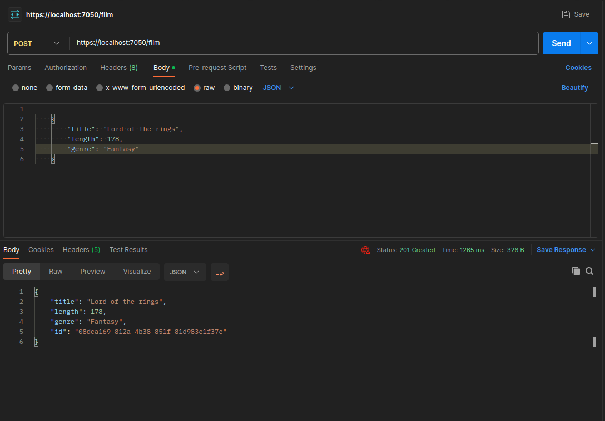
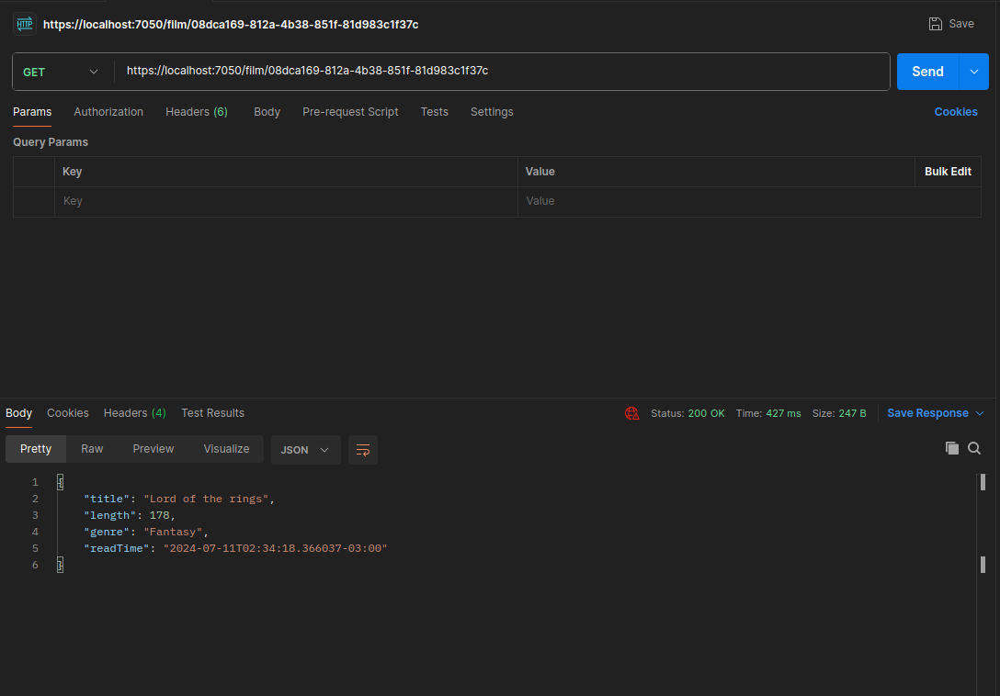
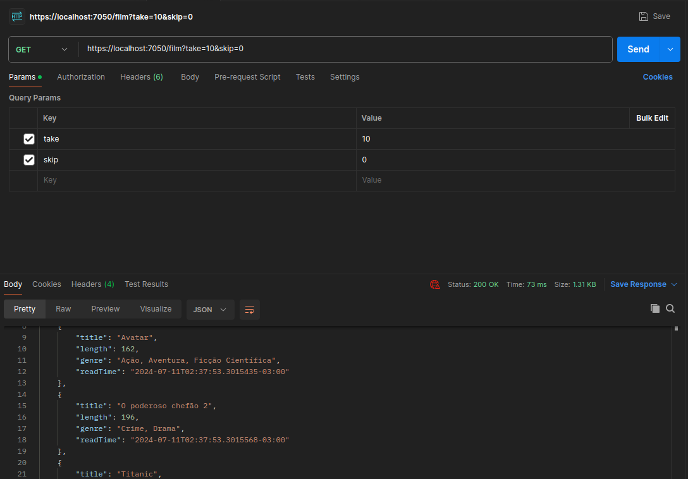
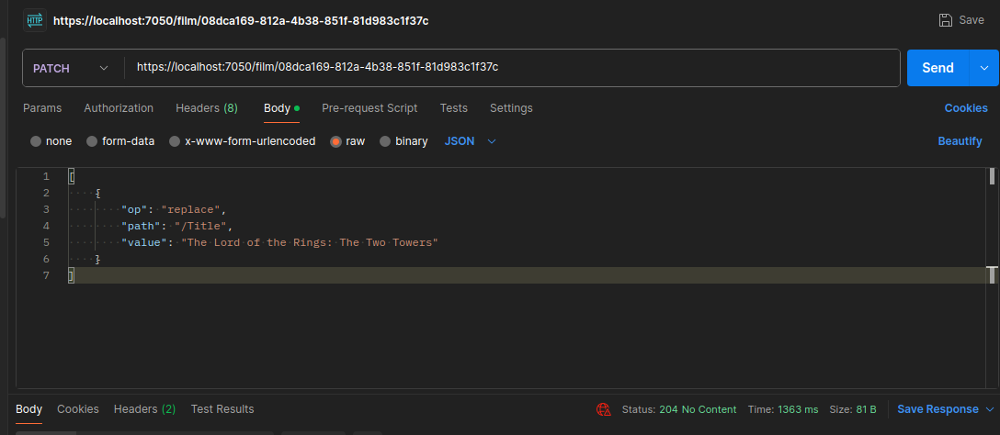
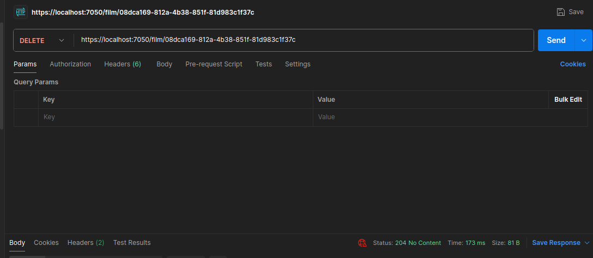

# API de Filmes
O objetivo desse projeto é criar uma RESTful API com .NET que permite a inserção, consulta, edição, e remoção de dados de filmes contidos em banco de dados MySql.

## Instalação
### Pré-requisitos

- [.NET SDK](https://dotnet.microsoft.com/en-us/download/dotnet/6.0) (versão 6.0.132)
- [MySQL](https://www.mysql.com/downloads/) (versão 8.0.37)

### Passos para Instalação

1. **Clone o Repositório**
   ```bash
   git clone https://github.com/JoaoVictorFdeBarros/FilmsAPI-.NET.git

   ```
2. **Configuração do Banco de Dados**
    
    Como o projeto tem fins didáticos a string de conexão está diretamente em [appsettings.json](./appsettings.json), faça as alterações necessárias para conectar no seu Banco de Dados MySql.

3. **Dependências e Migrações** 
    ```bash
    dotnet restore
    dotnet ef database update
    ```
4. **Execução**
    ```bash
    dotnet run
    ```


## Funcionamento
Em [Film.cs](./models/Film.cs) foi definida a estrutura básica de uma entrada de filme, com Título, Duração e gênero, que foi aplicada à tabela do banco de dados a partir de uma [Migration](https://learn.microsoft.com/pt-br/ef/core/managing-schemas/migrations/?tabs=dotnet-core-cli). 

O tratamento das requisições está organizado no [FilmController.cs](./Controllers/FilmController.cs).
### Inserção
A request POST é tratada para inserir dados no banco.



### Leitura
A request GET tem duas rotas, com id para buscar um filme específico e com os parâmetros de take e skip para buscar todos os dados.

- **GET /films/{id}**: Busca um filme específico pelo ID.
- **GET /films?take={n}&skip={m}**: Busca todos os filmes com paginação.



### Edição
A request PATCH permite alterar as informações armazenadas.


### Remoção
A request DELETE permite remover os dados do filme.


## Códigos de resposta
- **200 OK**: Requisição bem-sucedida.
- **201 Created**: Recurso criado com sucesso.
- **400 Bad Request**: Requisição malformada ou parâmetros inválidos.
- **404 Not Found**: Recurso não encontrado.
- **500 Internal Server Error**: Erro no servidor.
